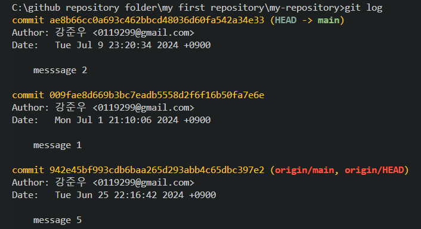

# CLI 버전관리
1. CLI 버전관리란 무엇인가?

- console에서 명령어를 사용해서 버전 관리를 하는 것

2. git log를 치면 나오는 HEAD는 어떤 의미가 있나요?

- 현재 위치하고 있는 버전을 뜻한다.

3. 아래 그림(fig. 1)에서 최신 버전에서 두번째 버전으로 돌아가려면 
어떤 명령어를 써야하나요(커밋 메세지가 "message 1"인 버전)
```bash
git log "버전 번호"
git checkout "버전 번호"
```
*fig 1. git log 시 결과* <br>

4. main branch의 최신 버전으로 돌아가려면 어떤 명령어를 써야하나요?

- git checkout master

5. HEAD, HEAD -> main(혹은 master)는 어떤 차이가 있나요?

- HEAD -> main은 현재 위치하고 있는 버전이 가장 최신 버전임을 나타내고, HEAD는 그렇지 않은 차이가 있다.

# add 옵션, Editor
1. `git commit -am "message"` 에서 -am은 -a, -m 옵션이 합쳐진 것입니다. 각각은 어떤 의미를 가지는 옵션인지 말해보세요.

- -a : working tree에서 staging area로 진행상황을 옮겨주는 역할을 한다. (add)
- -m : 진행상황의 version을 생성해준다. (commit)

2. `git commit -am "message"`에서 -a 옵션은 실수를 방지하기 위한 조건이 있습니다. 조건이 무엇인가요?

- untracked file에는 -a옵션이 적용되지 않는다.

3. `git config --global core.editor "vim"`의 뜻을 설명해보세요.

# git reset, revert
1. 위 그림(fig. 1)에서 `git reset --hard 009fae8d669b3bc7eadb5558d2f6f16b50fa7e6e`을 하면 결과가 어떻게 되나요?

- 현재 진행상황을 모두 삭제시키며 현재 버전이 message 1으로 변경되고, 이후에 생성되었던 message 2는 삭제된다.

2. `git revert 009fae8d669b3bc7eadb5558d2f6f16b50fa7e6e`을 하면 결과가 어떻게 되나요?

- 현재 진행상황은 유지하면서 현재 버전이 message 1으로 변경되고, message 2는 삭제된다.


3. `git reset ...`과 `git revert ...`는 의미가 비슷한데, 용도에 차이를 두고 사용한다면 어떤 차이가 있나요?

- 특정 버전으로 변경할때 해당 버전 이후에 쌓인 버전들을 삭제해야 할때는 reset, 삭제하지 않고 유지할때는 revert를 사용한다.

# tag, branch
1. tag는 왜 쓰이고 무엇을 대신하는 건가요?

- 버전 식별을 위한 commit id를 대신하는 간편한 이름. 버전 이름을 이해하기 쉬워서 찾기 쉽다는 장점이 있다.

2. branch는 생성한다는 것은 어떤 의미인가요?

- 하나의 파일에서 여러 갈래의 버전을 나누어 다르게 관리하겠다는 뜻을 가지고 있다.

# branch
1. branch는 왜 필요한가요?

- 한개의 파일을 조금 수정하여 여러개를 다르게 제공해야 하는 상황에서 하나의 저장소만 사용할 수 있게 해준다.

2. 아래 fig 2.와 fig 3.의 그림과 커밋을 순서대로 각각 대응 시켰을 때, 두 번째 그림에서 새로운 그림을 그리기 위해 분기(branch)를 생성하려면 어떻게 해야하는 지 코드를 작성해주세요 (HEAD는 맨 위 그림 즉, 최신 버전을 가르치고 있음.) 

 *fig 2.*<br>
 *fig 3.*<br>

```bash
git checkout "72974ff7d...."
git branch "message 4_1"
```

3. 각자의 main branch의 최신 버전에서 `dev-{이름} (예: dev-junwoo)`이라는 브랜치를 만들고 (branch가 고장난 것 같으면 `dev-junwoo_1`처럼 만들어도 됩니다.)


4. 이 과제를 작성하고 본인의 remote repository로 push 한 뒤


5. 강준우 repository에 `dev`라는 branch에 PR을 날려보세요. (push가 안될 경우 `git push --set-upstream dev-{이름}`로 push 해보세요.)


6. 다했으면 하는 과정 각각을 스크린샷해서 여기에 올려주세요. 드래그앤 드랍으로 하면 됩니다.

### Advanced
1. HEAD 옆 origin/main, origin/dev, origin/HEAD는 무슨 뜻일지 추측해보세요.
2. `git checkout -b {branch_name}`에서 -b 옵션은 '{branch_name}라는 이름으로 새로운 브랜치를 만든다.' 이 명령어 결과와 같은 결과를 만드는 명령어를 찾아보세요.
3. `git config ...`에서 바꿀 수 있는 다른 명령어들은 무엇이 있나요? 맘에 드는 설정을 바꾼 뒤 알려주세요.
4. `git reset --hard ...`처럼 `git reset`에는 `--hard` `--mixed` `--soft`등 옵션이 있는데 이 옵션이 어떤 차이가 있는지 알려주세요.
5. 자주 사용되는 branch의 이름들이 몇 가지가 있습니다. 어떤 것들이 있고 무슨 이유로 그 branch를 사용하는지 2가지만 알려주세요.

