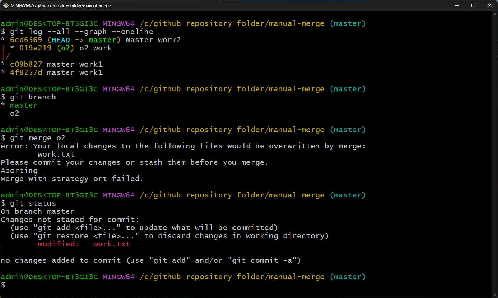
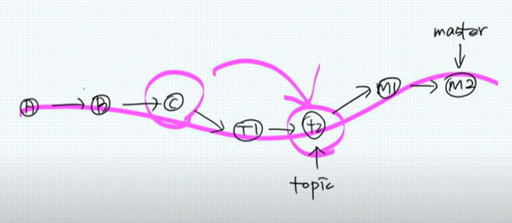

## 1. 각자 폴더 만들기
## 2. 각자 폴더에 붙여넣기
## 3. `dev`로 브랜치 변경 후 `git pull`
## 4. `dev-{이름}-3rd`브랜치 생성 이후 `checkout`하고 작업하기


# Branch & Merge
1. base는 무엇을 의미하나요?

- branch들이 공통 조상으로 가지고 있는 branch

2. branch, merge, confilct가 각각 무엇을 의미하는지 알려주세요.

- branch : 하나의 파일을 여러개의 버전으로 관리하려 할때 각각 다르게 뻗어나간 버전들을 뜻한다.
- merge : 서로 다르게 뻗어나간 branch들의 변경사항을 합쳐서 함께 다시 관리하고 자하는 것을 말한다.
- conflict : merge시에 branch들이 같은 파일의 같은 내용을 수정하였을 경우에 충돌이 일어날 수 있다.

3. merge를 왜 사용해야 하나요?

- 한 branch에서 진행한 작업이 master branch에서 유옹하여 통합할 필요가 있을 때 사용된다.

4. 두 개의 branch를 병합(merge)할 때, 병합되는 쪽이 아닌 병합받는 쪽에 checkout을 해야하는 이유를 history와 관련지어 설명해주세요. (ppt p.6 참조)

- 병합받는 쪽이 가장 최근 history로 이동하여 merge가 일어나기 때문에 

# Merge & Conflict
1. `Auto-merging`이 무엇인지 알려주세요.

- merge시에 각 branch의 수정사항이 서로 다른 파일에 존재하거나, 같은 파일의 다른 부분에서 존재하면 자동으로 merge가 일어난다.

2. 스터디 시간에 배운 `conflict`는 무엇을 의미하는 지 알려주세요.

- 같은 파일의 같은 부분에서 수정사항이 존재하면 conflict가 일어나 자동으로 merge가 일어나지 못하게 된다.

3. 다음 세가지 `서로 다른 파일 병합`, `같은 파일 다른 부분 병합`, `같은 파일 같은 부분 병합` 중 `auto-merging` 기능이 제공되는 것을 구분하고 제공되지 않는 것은 왜 제공되지 않는 지 알려주세요.

- '서로 다른 파일 병합', '같은 파일 다른 부분 병합'만 'auto-merging' 기능이 제공된다. '같은 파일 같은 부분 병합'같은 경우에는 시스템이 어느 수정 사항을 적용해야 할지 판단할 수 없기 때문이다.

4. `fig.1`은 `conflict` 발생을 유도한 후 명령창입니다. 입력한 명령어는 다음과 같을 때, 이후 `conflict`를 해결하는 방법을 알려주세요.
```bash
git checkout master
git log --all --graph --oneline
git branch
git merge o2
git status
```
*fig.1*

- master branch에서 git add, git commit을 통해서 생긴 수정사항을 commit한 뒤에 merge를 시도해야 한다.

# Cherry-pick & rebase
1. `cherry-pick`와 `rebase`는 어떤 기능의 명령어이고 왜 필요한지 알려주세요.

- cherry-pick : 원하는 버전의 수정사항만을 픽업하여 merge
- rebase : 버전들의 갈래들을 한줄로 만드는 것
- cherry-pick는 특정 버전에서의 특정 commit만을 현재 버전으로 적용하고 싶을때, rebase는 branch들을 정리하고 싶을때 사용된다.

2. `fig.2`을 직접 구현한 결과가 `fig.3`입니다. `fig.2`의 결과와 같게 만들려면 어떻게 해야하는 지 알려주세요. 
*fig.2*
*fig.3*

```bash
git checkout master
git cherry-pick 41a0109
```

3. `fig.3`을 `fig.4`의 결과와 같게 만들고 싶다면 어떤 명령어를 쳐야하는지 알려주세요(HEAD는 HEAD->master에 있음.)

```bash
git checkout master
git rebase topic
```

*fig.4*
4. `rebase`의 조건이 있는데 어떤 것일 지 추측해보세요.(정답이 되는 조건은 설명한 적 있음.)

- rebase하는 버전들이 remote로 push 된 상태가 아니어야 한다.

# Advanced
1. *fig.5* 에서 `HEAD`가 `master`의 최신 버전이 아닌 `dc9d3c7`에 checkout 되어 `git merge topic`하게 된다면 어떻게 될지 추측해보세요.
*fig.5*

- merge는 충돌하는 파일이 없으면 가능하나 push시에 충돌이 일어날 것으로 예측된다.

2. *fig.5* 에서 `git commit --amend`로 최신 버전(`33763e0`, `HEAD->master`)의 커밋 메세지를 수정할 수 있었습니다. 만약 최신 버전의 __커밋 내용__ 즉, 파일 안의 코드를 한 줄 수정하고 싶을 때는 히스토리를 아예 삭제하는 `git reset --hard dc9d3c7` 대신 어떤 명령어를 사용해야 하는지 알려주세요.

- git add 파일명
- git commit --amend

3. `cherry-pick`에서도 `conflict`가 발생할 수 있습니다. 충돌 원인을 예상해보고 해결 방법을 알려주세요.

- cherry-pick 하려는 commit이 현재 가지고 있는 local에서의 수정 사항과 충돌하면 conflict가 발생할 것으로 예상된다. cherry-pick하려는 버전의 파일 수정부분으로 이동하여 충돌을 예방할 수 있을 것이다.

4. 터미널에 `git merge --help`를 쳐보면 merge에도 굉장히 많은 옵션이 있음을 알 수 있습니다. 이미 실행한 merge를 취소하는 옵션을 포함해서 세 가지의 옵션을 임의로 골라 알려주세요.

- git merge --ff : 현재 브랜치와 merge 대상 브랜치가 fast-forward 관계에 있는 경우 commit을 생성하는 것이 아니라 브랜치의 참조 값만 변경되도록 한다.

- git merge --no-ff merge 대상 branch와 fast-forward 관계여도 강제로 merge commit을 생성하고 병합한다.

- git merge -squash : merge 시에 commit 이력과 merge된 branch의 이력 모두를 없앤다.

5. 정말 만약에... merge 한 브랜치를 push하고 pr이 승락된 브랜치를 되돌려야한다면 어떻게 되돌릴 수 있을 지 알려주세요.....

- git reset --hard로 head를 PR 이전의 base commit으로 돌리고 해당 commit을 다시 git push --force origin으로 변경사항을 push

6. branch간에 merge를 진행할 때 새로운 commit이 생겨날 수도 있고 아닐 수도 있습니다. 이 관점에서 `fast-forward merge`, `3-way merge`를 비교하여 알려주세요.

- fast-forward merge : master branch에서 나의 branch와 merge를 시켜줄 때 따로 commit을 생성시키지 않고 master branch와 나의 branch가 master 이후의 동일한 commit을 가르키도록 이동시켜 merge를 진행시켜준다.

- 3-way merge : 두개의 branch가 base에서 분리된 commit을 참조할 시에 base와 각각 branch 2개의 참조 commit을 비교하여 이를 기준으로 merge를 진행시켜준다.